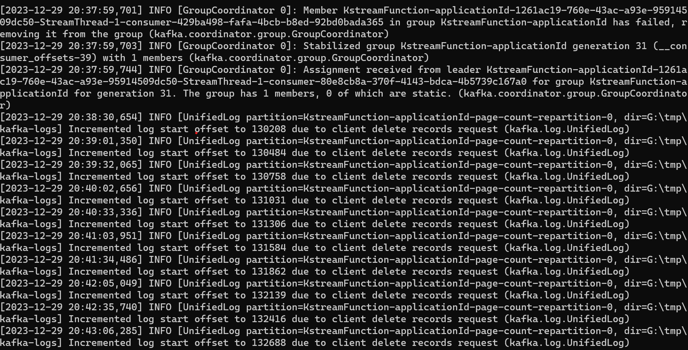
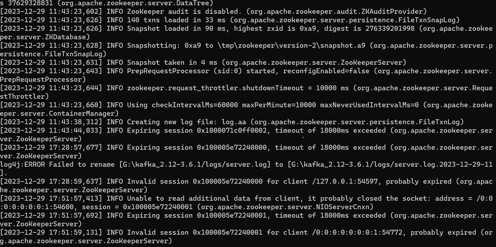
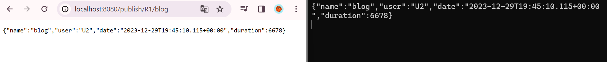
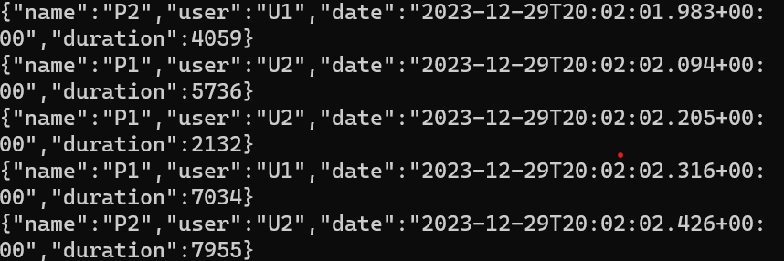
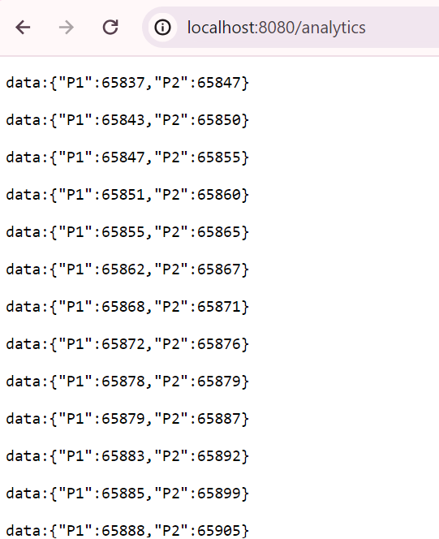

# Activity 6 : Kafka Stream Application

## About the application
## What is Kafka ?
Apache Kafka is an open-source distributed event streaming platform used by thousands of companies for high-performance data pipelines, streaming analytics, data integration, and mission-critical applications.

## Zookeeper
Apache ZooKeeper is an open-source server for highly reliable distributed coordination of cloud applications for streaming .

## Producer & Consumer

### Producer
Producer is a client application that publishes (writes) events to a Kafka cluster.

### Topic
To store streams of events durably and reliably for as long as you want.

### Consumer
Kafka consumer group is a set of consumers which cooperate to consume data from some topics.

  

## Supplier
processor supplier that can create one or more Processor instances. It is used in Topology for adding new processor operators.

 

## Page Event Function as Instance Update

## Kafka Streams
Kafka Streams is a client library for building applications and microservices, where the input and output data are stored in Kafka clusters.

